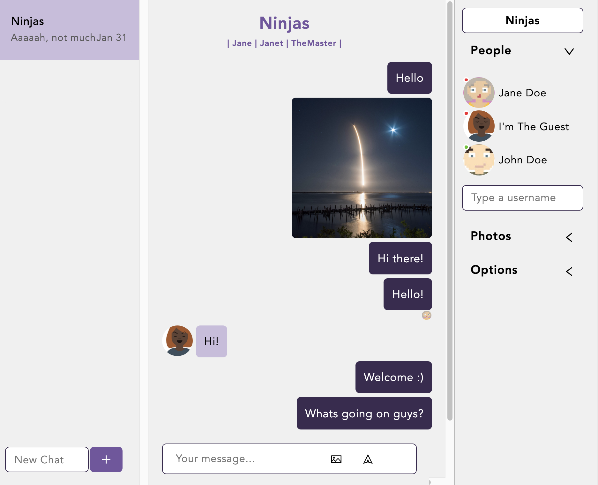

# Chit-Chat

[Demo app](https://chit-chat-8993.netlify.app/)

A private chat messenger that only allowed invited only into the chat-room. Simple interface provided by react-chat-engine itself with the very basic utilities for chat. Chat feed updated in real-time when submit message. User also be able to upload a photo to the chat conversation.

As a guest user,
Username: Janet (with 'J' in upper case)
Password: password

## Dependencies

- [Ant design icons](https://github.com/ant-design/ant-design-icons)
- [Axios](https://www.npmjs.com/package/axios)
- [React-chat-engine](https://www.npmjs.com/package/react-chat-engine)
- [Chat engine server](https://chatengine.io/)

## Screenshot

